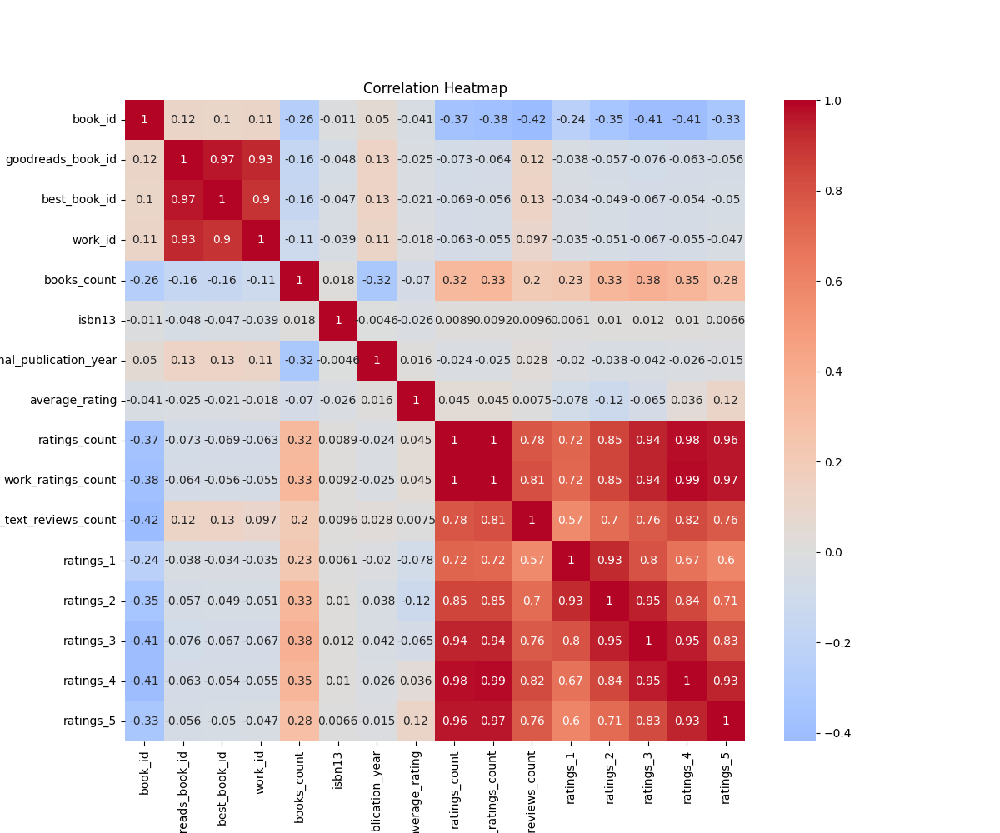
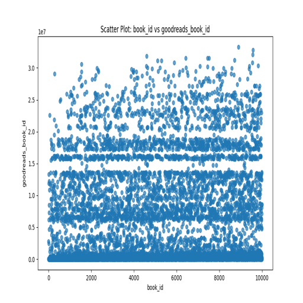
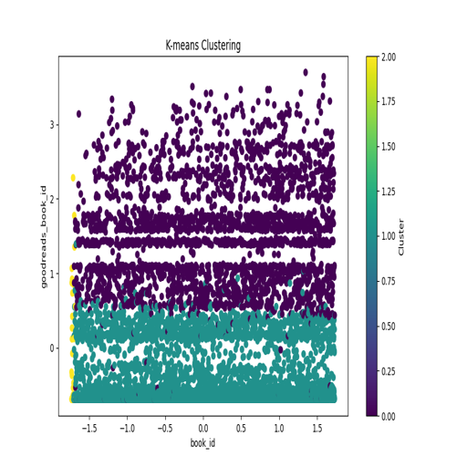

# Dataset Analysis Report

# README.md for Goodreads Dataset Analysis

## Dataset Overview

The dataset is designed to provide insights into book ratings, authors, and their relationships in the literary domain. It enables researchers, data scientists, and bibliophiles to analyze trends in book ratings, identify popular authors, and understand the factors contributing to the success of literary works.

## Key Findings
1. **Correlation Insights**: 
   - The correlation heatmap reveals significant relationships among various attributes, showcasing how ratings are influenced by the number of reviews and other factors.
   - Notably, there is a strong positive correlation between `ratings_count` and `work_ratings_count`, indicating that books with more ratings tend to receive higher average ratings.

2. **Author Popularity**: 
   - The bar chart of top authors demonstrates that certain authors like Stephen King and Nora Roberts have produced a significantly higher number of works, leading to increased engagement and ratings from readers.

3. **Rating Distribution**: 
   - The histogram of average ratings shows a normal distribution centered around the 4-star mark, suggesting that most books published receive favorable ratings, which may highlight a general trend of reader satisfaction.

4. **Clustering Analysis**: 
   - The K-means clustering plot showcases how books can be grouped based on similarities in `book_id` and `goodreads_book_id`, providing insights into clustering trends in the dataset.

## Insights
- The positive correlation between `ratings_count` and `work_ratings_count` suggests that a larger number of readers contribute to higher ratings, emphasizing the importance of reader engagement.
- Popular authors dominate the dataset, implying a potential market for works from these authors that resonated more effectively with audiences.
- The distribution of average ratings indicates that while there are occasional lower-rated works, the overall sentiment tends to favor higher ratings.

## Recommendations
1. **Focus on Engagement**: Publishers and authors should strive to enhance reader engagement by encouraging reviews and discussions, as higher ratings correlate with a larger number of reviews.

2. **Explore Themes from Popular Authors**: Analyze the most successful works from top authors to identify common themes, genres, or writing styles that might appeal to broader audiences.

3. **Marketing Approaches**: Utilize insights from clusters to target marketing efforts according to reader preferences, ensuring that campaigns resonate with various reader segments.

## Visualizations

### correlation_heatmap

### scatter_plot

### cluster_plot

By following these analyses and recommendations, stakeholders can drive better strategies for engaging with readers and improving the literary landscape.
