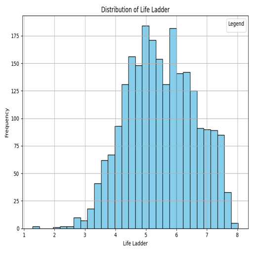
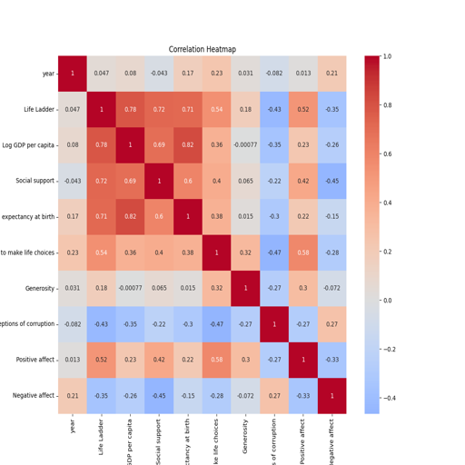
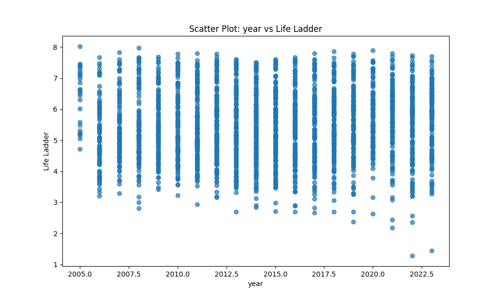
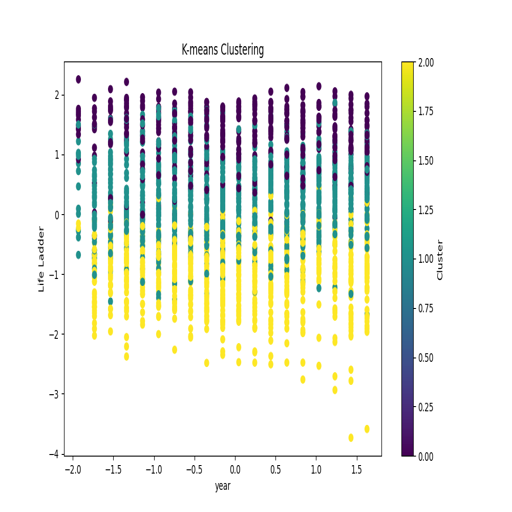
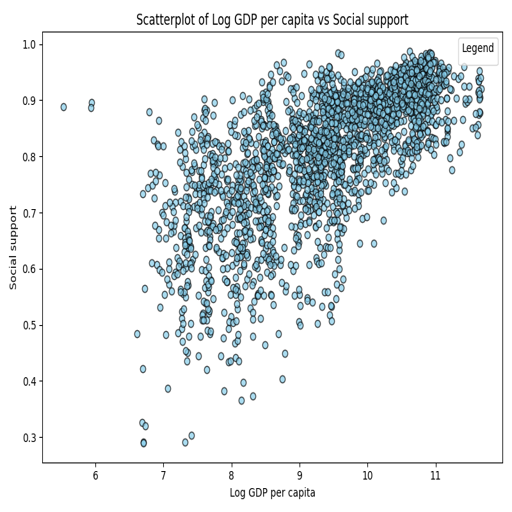

# Automated Analysis of happiness.csv

# Dataset README

## Purpose
This dataset aims to analyze various socio-economic factors that contribute to the perceived quality of life across different countries. The focus is on understanding how different metrics, such as GDP, social support, and life expectancy, correlate and affect the overall happiness as indicated by the Life Ladder score.

## Key Findings
1. **Distribution of Life Ladder**: The distribution of the Life Ladder scores shows a tendency towards values between 5 and 7, indicating a generally positive perception of life satisfaction among many countries.
   

2. **Correlation Insights**: There is a significant positive correlation between Log GDP per capita and Social support, indicating that wealthier countries tend to have better social support systems in place.
   

3. **Impact of Time on Life Ladder**: Scatter plots demonstrate changes over time, reflecting various trends and fluctuations in life satisfaction scores across different years.
   

4. **Clustering Analysis**: Clustering of data reveals distinct groups of countries regarding their Life Ladder scores and other socio-economic measures, which could indicate patterns in development and quality of life.
   

5. **GDP and Social Support Relationship**: A scatter plot representing the relationship between Log GDP per capita and Social support shows a clear trend; as GDP increases, social support also tends to improve.
   

## Insights
- **Social Support Matters**: Countries with higher social support indicators consistently reflect better Life Ladder scores, suggesting that social frameworks play a crucial role in happiness.
- **Economic Growth**: Economic stability and growth, as indicated by Log GDP per capita, are closely related to overall life satisfaction. This emphasizes the importance of economic policies that can boost income at both individual and societal levels.
- **Yearly Trends**: The yearly data shows fluctuations in the Life Ladder, indicating environmental, political, or economic events affecting life satisfaction more heavily during certain periods.

## Recommendations
- **Policy Focus on Social Support**: Governments should prioritize enhancing social support systems as part of broader economic growth strategies. Providing safety nets and support services can lead to improvements in life satisfaction.
- **Monitoring Economic Indicators**: Regular assessment of GDP impacts on quality of life can help direct resources to areas that fundamentally improve citizen welfare.
- **Further Research**: Continued exploration of time-series data to understand the underlying causes of fluctuations in happiness is suggested. This research can help identify strategies that countries can adopt to stabilize or improve life satisfaction over time.