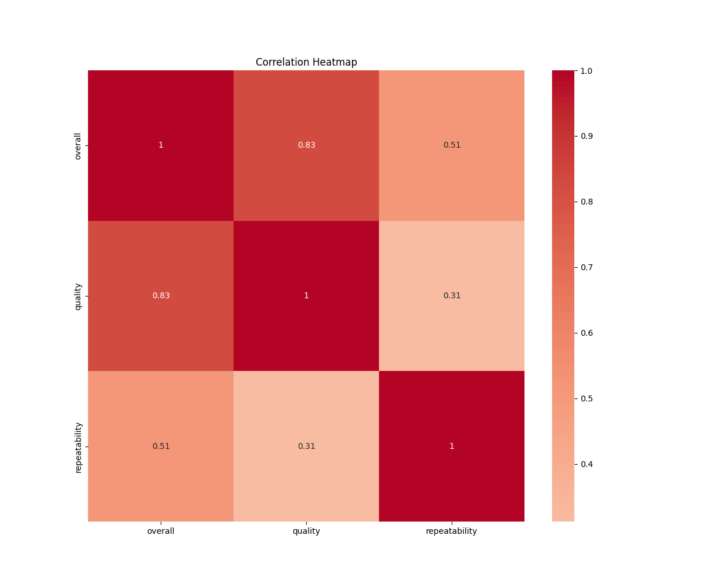
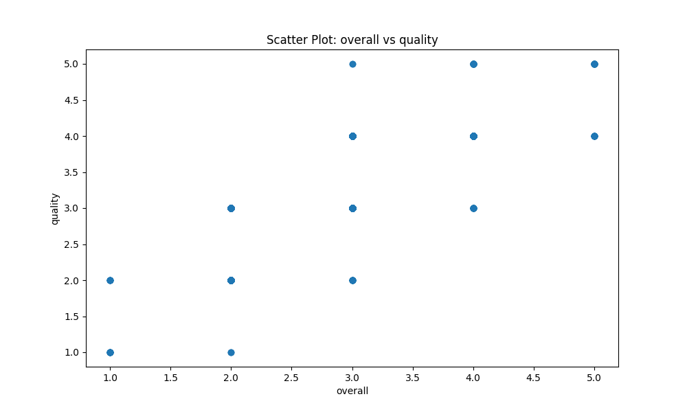
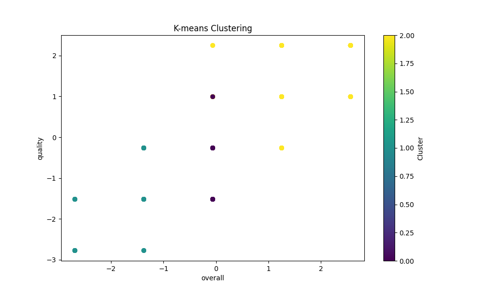

# Dataset Analysis Report

# Media Dataset Analysis

## Overview of the Dataset
The dataset provided, named **media.csv**, consists of **2,652 entries** and **8 attributes**. Each attribute has distinct characteristics which include:

- **date**: Represents the date associated with the media entry (data type: `object`).
- **language**: Language of the media content (data type: `object`).
- **type**: Type/category of the media (data type: `object`).
- **title**: Title of the media entry (data type: `object`).
- **by**: Author or creator of the media entry (data type: `object`. Missing for 262 entries).
- **overall**: Numeric rating of the media (data type: `int64`).
- **quality**: Quality rating of the media (data type: `int64`).
- **repeatability**: Measure of how often the content is encountered (data type: `int64`).

### Missing Values
The dataset has a total of 99 missing values in the **date** column and 262 missing entries for the **by** column. The other columns are complete with no missing data.

## Detailed Insights from Data Analysis
The following points summarize key insights derived from the dataset:

### Numeric Summary
- **Overall Ratings**:
  - Mean: 3.05, median (50th percentile): 3.0, suggesting a central tendency towards average ratings. The distribution appears to be slightly right-skewed with a maximum rating of 5.
  
- **Quality Ratings**:
  - Mean: 3.21, median (50th percentile): 3.0. This metric also suggests a general tendency towards average, with a slight skewness in quality ratings due to higher seldomly achieved ratings.

- **Repeatability**:
  - The mean value of repeatability is 1.49 with most frequent occurrences at the lower end (1 rating), indicating that most content is rarely encountered repeatedly by users.

### Correlation and Relationships
Initial analysis through visualizations (e.g., a correlation heatmap, see `correlation_heatmap.png`) suggests the following observations:
- There is a moderate positive correlation between **overall ratings** and **quality ratings**.
- **Repeatability** negatively correlates with overall and quality ratings, highlighting a potential issue where higher ratings do not guarantee repeated exposure.

## Key Statistical Observations
- The distribution of ratings (both overall and quality) indicates a preference or bias in the ratings towards the middle scale (3 stars).
- The **repeatability** statistic indicates a need for better user engagement or content promotion for higher-rated media.

## Potential Business or Research Implications
From a business perspective, the findings lead to several potential strategies:
1. **Content Improvement**: Focus on elevating the average quality of lower-performing media to improve overall scores and user retention.
2. **Marketing Strategies**: Increasing visibility or repeated engagement with higher-quality rated media may lead to improved user satisfaction and retention.
3. **User Engagement Tactics**: Investigating why certain media entries score high yet remain low in repeatability may uncover new promotional opportunities.

## Recommendations for Further Investigation
1. **Temporal Analysis**: Further investigation on how ratings evolve over time could yield insights into audience preferences and trends.
2. **User Segmentation**: Analyzing user interactions by identifying specific demographics behind the "by" attribute could enhance targeted marketing strategies.
3. **Missing Data Handling**: Strategies for addressing the missing date and author fields would cement a clearer longitudinal perspective.

By considering these factors, stakeholders can leverage insights to drive the performance of media offerings in a structured manner. 

## Visualizations
- **Correlation Heatmap**: `correlation_heatmap.png`
- **Scatter Plot**: `scatter_plot.png`
- **Cluster Plot**: `cluster_plot.png`

These visualizations provide a more detailed view of the relationship between the variables and highlight key trends in the dataset.

---  
This analysis serves to encapsulate the fundamental elements behind the media dataset, offering metrics that can guide decision-makers towards informed policies and actionable strategies in their media offerings.

## Visualizations

### correlation_heatmap

### scatter_plot

### cluster_plot

